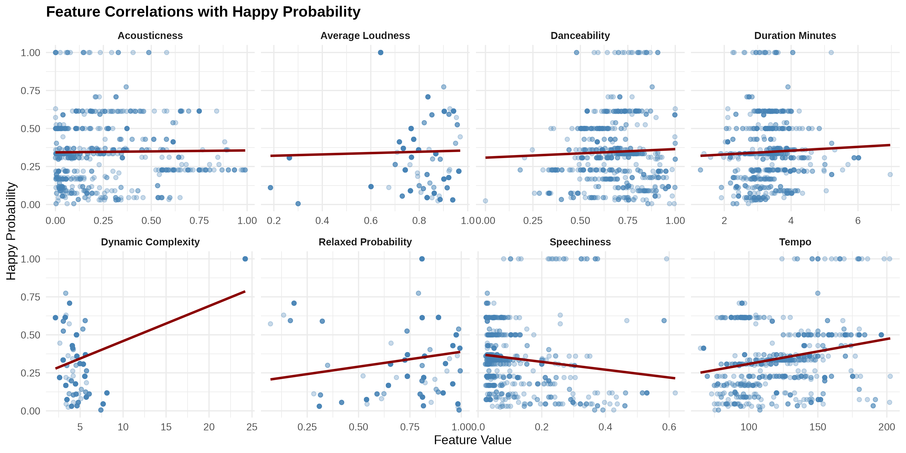
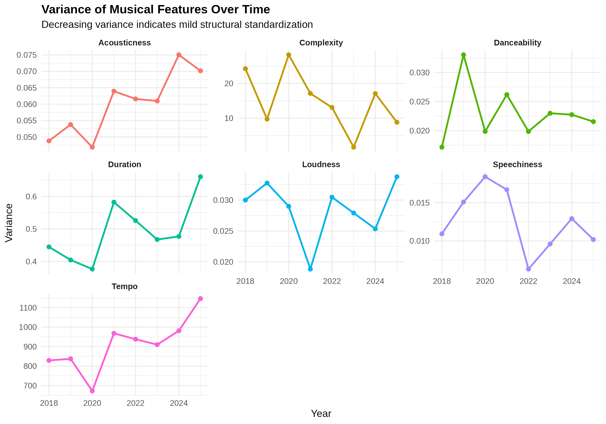

# 🎵 Billboard Top Songs Analysis (2018–2025)


> An exploratory data analysis investigating the macro-level trends, emotional resonance, and structural standardization of Billboard top songs over an 8-year span.

This repository contains the codebase, datasets, and analytical reports for our semester project at the **Indian Statistical Institute**.

---

## 📑 Table of Contents
- [Overview](#-overview)
- [Key Research Questions](#-key-research-questions)
- [Data Sources](#-data-sources)
- [Key Findings](#-key-findings)
- [Visualizations](#-visualizations)
- [Installation & Usage](#-installation--usage)
- [Team Members](#-team-members)

---

## 📖 Overview
Music trends evolve rapidly driven by technology, listener preferences, and streaming platforms. This project aggregates Billboard hit data from 2018 through 2025 to evaluate variables such as acousticness, duration, dynamic complexity, and generated emotion probabilities. The goal is to uncover structural patterns in modern popular music and understand what audio features correlate most strongly with listener reception.

---

## 🎯 Key Research Questions
Our analysis pipeline was designed to answer four primary questions:
1. **Evolution of Sound:** Is acousticness decreasing over time, indicating a shift toward electronic music?
2. **Emotional Drivers:** What structural and musical features are most strongly related to "happy" songs?
3. **Optimal Duration:** Is there an ideal song duration that correlates with higher Billboard rankings?
4. **Standardization:** Is modern music becoming more formula-based (measured via decreasing variance in track features)?

---

## 🗄️ Data Sources
The attributes and emotional characteristics of the songs analyzed in this repository were computed utilizing data from **[AcousticBrainz](https://acousticbrainz.org/)** alongside historical Billboard chart rankings.

---

## 🚀 Key Findings
* 🎛️ **The Electronic Shift:** After a brief rise in acousticness leading up to 2020, recent years (2024–2025) show a noticeable shift back toward electronic instrumentation.
* 😊 **The Anatomy of Happiness:** Contrary to the belief that pure tempo drives joy, our data shows that **dynamic complexity** has the strongest positive correlation with a song's perceived happiness.
* ⏱️ **The 3.5-Minute Sweet Spot:** The most popular songs (Top 20) cluster tightly around an average duration of 3.5 minutes, suggesting a highly optimized length for listener retention.
* 📉 **Mild Standardization:** The variance of certain acoustic and temporal features is slightly decreasing over time, hinting at a mild structural standardization in the industry.

---

## 📊 Visualizations

*(Note: Ensure your generated `.png` files from `analysis.R` are uploaded to the root of this repository for these images to render)*

### Feature Correlations with Happiness


### Variance of Features Over Time


---

## 💻 Installation & Usage

To reproduce our analysis and generate the visualizations locally, you will need **R** and the following packages: `dplyr`, `tidyr`, and `ggplot2`.

1. **Clone the repository:**
   ```bash
   git clone [https://github.com/Neeravvv/DARP-Project-repo.git](https://github.com/Neeravvv/DARP-Project-repo.git)
   cd DARP-Project-repo
   ```

2. **Install required R packages** (Run inside your R console):
   ```R
   install.packages(c("dplyr", "ggplot2", "tidyr"))
   ```

3. **Run the Analysis:**
   Open `analysis.R` in RStudio or your preferred IDE. Ensure your working directory is set to the repository folder, and source the script. It will automatically read the `top2018.csv` through `top2025.csv` files and generate high-resolution `.png` plots in your directory.

---

## 👥 Team Members
This project was completed by Group 9 as part of the Data Analysis curriculum at the Indian Statistical Institute:

* **Neerav Bhuyan**
* **Utkarsh Bharadwaj**
* **Sagnik Das**
* **Manogna Tejaswini**
* **Sandip Manna**
* **Manvi Garodia**

---
*If you find this analysis interesting, feel free to star ⭐ the repository!*
